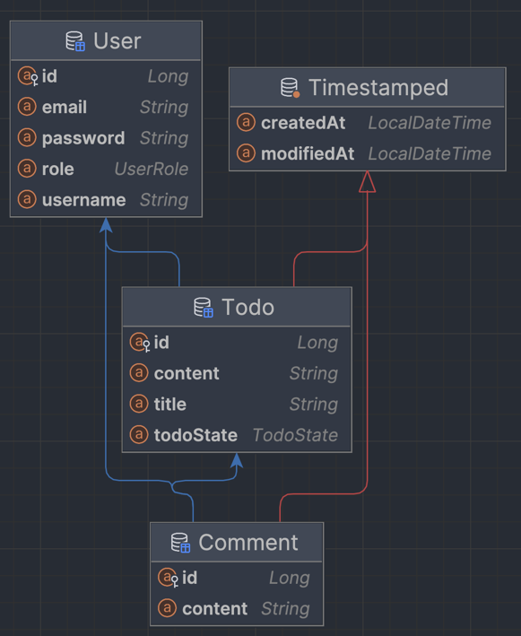
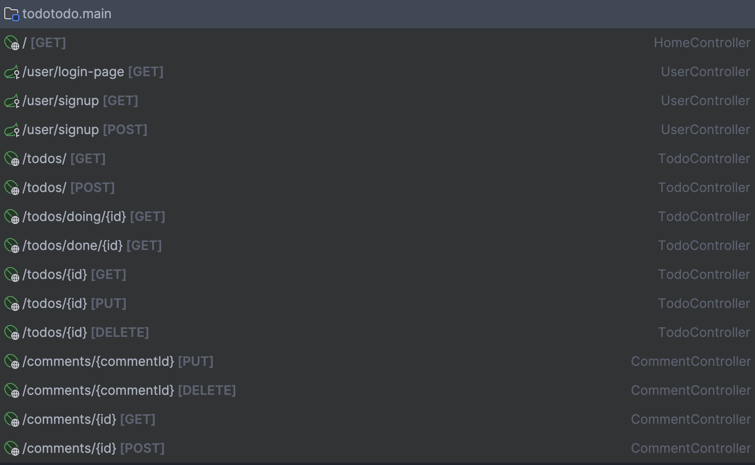
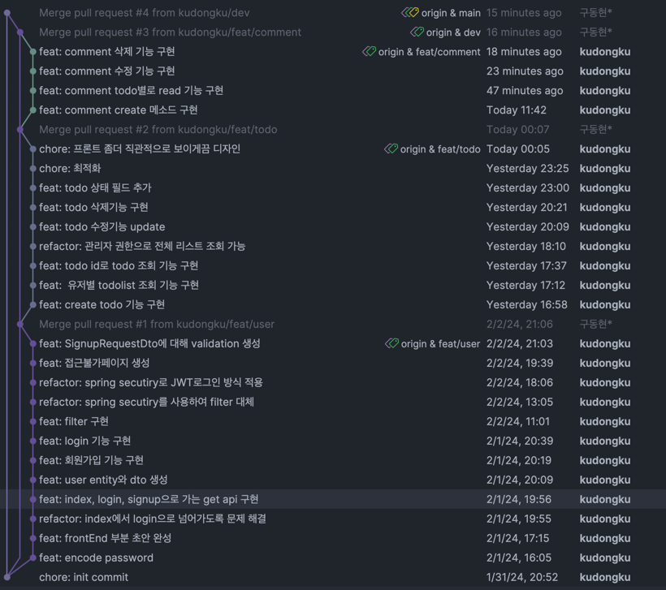

# todotodo
- 내일배움캠프 주특기 숙련주차 개인과제입니다.
- 입문주차 개인과제였던 캘린더 프로젝트에 회원기능을 중점적으로 다양한 기능이 추가되었습니다.

## 진행과정

---

> ver 1.0

### 1. 회원기능 구현하기
1. password encoder 사용해서 비밀번호 암호화
2. jwtUtil 구현
3. 회원가입 기능 구현
4. 로그인 기능 구현
### 2. todo 기능 구현하기
### 3. comment 기능 구현하기
### ERD

### API 명세서

### git work flow

### 미흡한 부분

- 구현지침 준수
  - 배포 미완료
  - 회원가입시 client로 성공했다는 메시지와 상태코드 반환하는 법
  - 로그인시 성공했다는 메시지 상태코드 client로 반환하는 법
  - 할일카드 작성시 저장된 할일 객체 client로 반환하기
  - 할일카드 목록 조회시 작성자 별로 목록이 나눠져서 조회 기능
  - 작성자와 같은 토큰인지 확인하고 수정 삭제 가능하게
  - 댓글은 작성자 정보 보이게끔